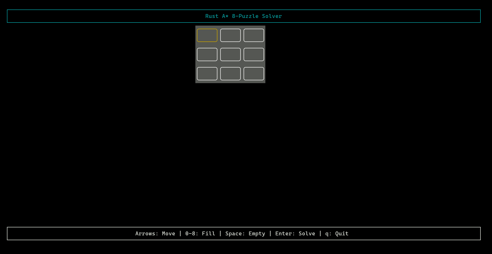
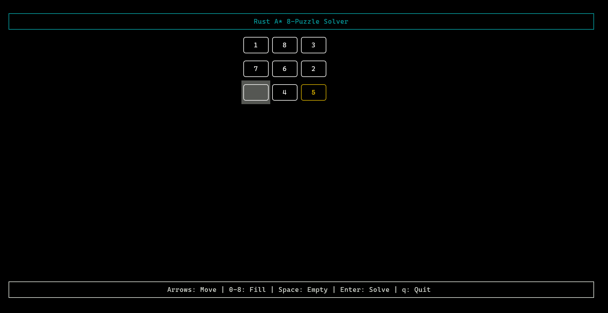
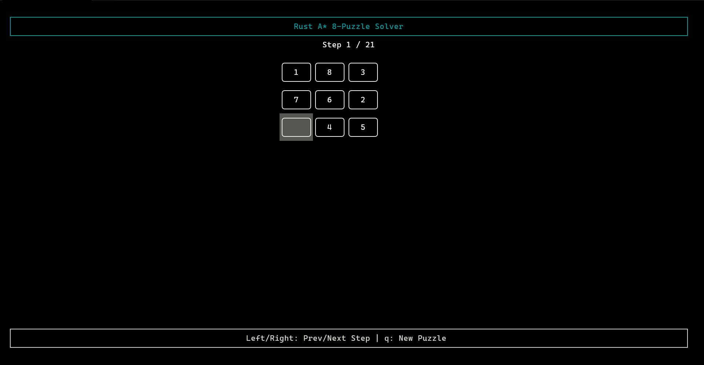
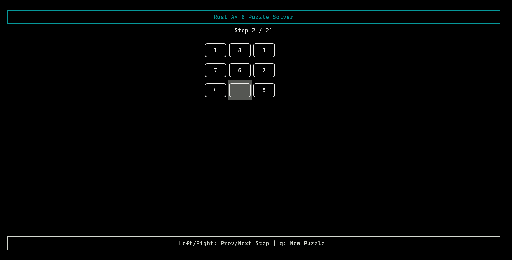
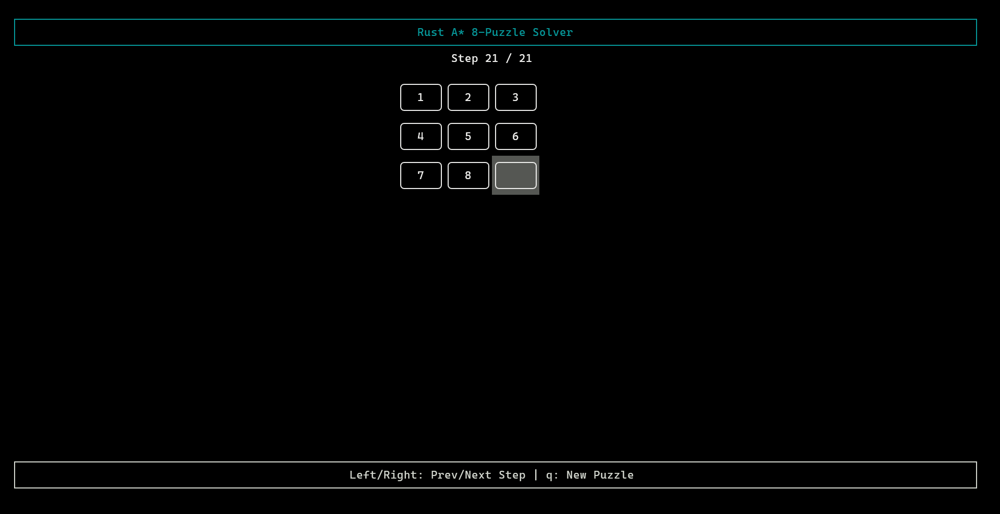
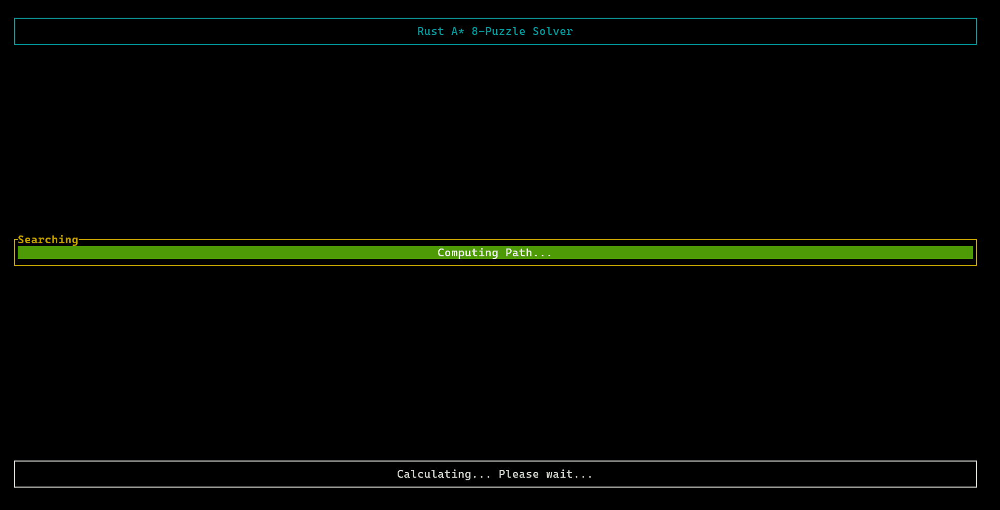
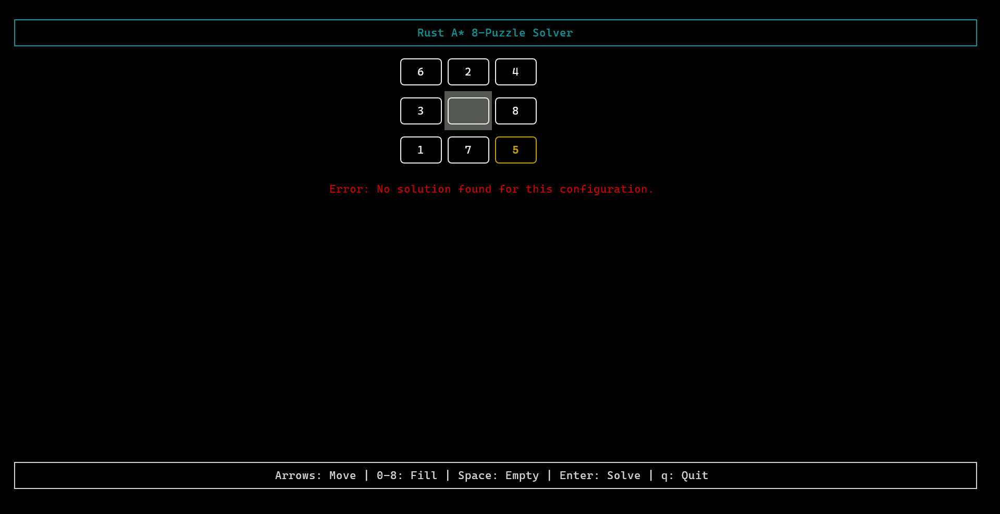

# 8-Puzzle Solver

Yeay, another 8-puzzle solver! _Who needs this, though?_ Well, this is just my attempt to solve 8-puzzle using A\* algorithm. Previously, I did not know that A\* algorithm can be used for this, but I was recommended a few videos in YouTube about using A\* search to solve 8-puzzle. I thought "Hmm, that's interesting." And so this is my attempt.

## Prerequisites

- [Pixi by prefix.dev](https://pixi.prefix.dev).
    - Rust is included inside. No need to instal it separately.

## Install Dependencies

1) Install Pixi's dependencies: `pixi install`. This will install Cargo and Rust language.
2) Install Cargo's dependencies: `pixi run build`.

## Run Program

`pixi run start`

## Screenshots

